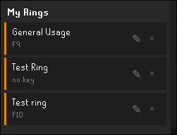
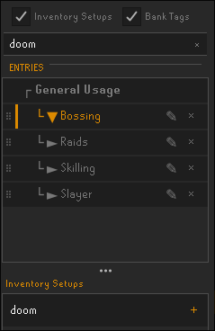
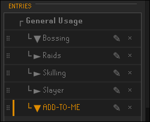
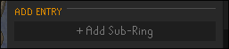
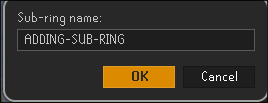
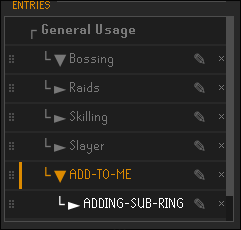
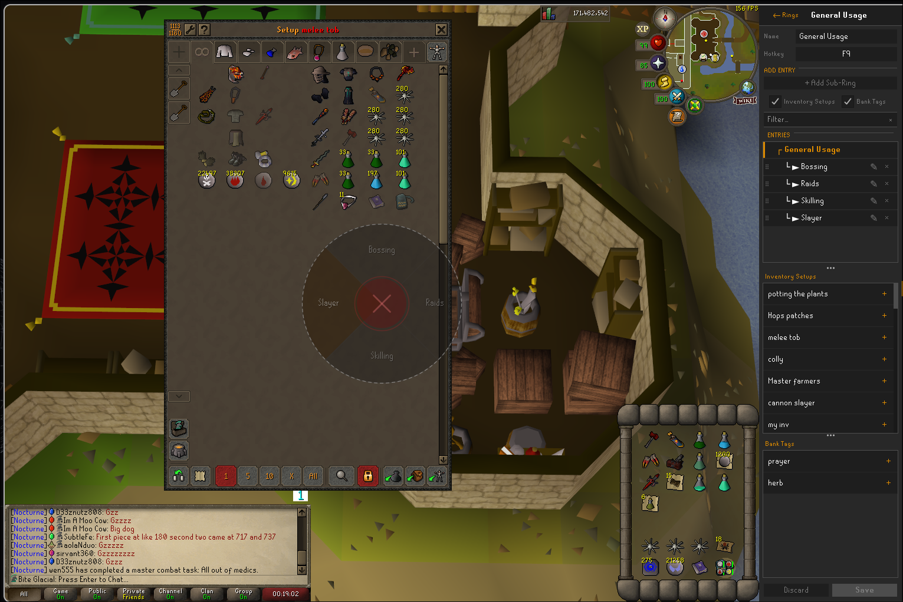

# Ring Menu

A radial hotkey menu for Old School RuneScape that lets you open any bank tag or inventory setup with a single keypress.

---

## Overview

Ring Menu lets you bind any number of radial menus to hotkeys. Each ring holds entries — bank tags, inventory setups, or sub-rings that lead to another ring. Press the hotkey, hover the slice you want, and click. The bank opens with your layout applied instantly.

**Requires:** [Bank Tags](https://github.com/runelite/runelite/wiki/Bank-Tags) · [Inventory Setups](https://runelite.net/plugin-hub/show/inventory-setups)

---

## Features

- Bind multiple rings to different hotkeys
- Mix bank tags and inventory setups in the same ring
- Nest rings inside rings with sub-rings
- Search and filter your setups directly in the panel
- Drag and drop to reorder entries
- Rename rings and sub-rings in place

---

## Setup

### Creating a ring

Open the Ring Menu panel from the sidebar and click **+ New Ring**.

Give the ring a name, assign a hotkey, then open it to start adding entries.

### Adding entries

Inside a ring's detail view, use the provider picker at the bottom to browse your bank tags and inventory setups. Type in the filter box to narrow results, then click **+** to add an entry to the ring.

Click **Save** when you're done.

### Sub-rings

Sub-rings are rings nested inside another ring. When selected in the overlay they open their own ring, and the center button becomes a back arrow to return to the parent.

To add a sub-ring, open the ring you want to add it to and select the entry it should live under.

Click **+ Add Sub-Ring** in the ADD ENTRY section.

Enter a name for the sub-ring.

The sub-ring appears nested under the selected entry, ready to have its own entries added.

### The overlay

Press your hotkey anywhere in-game. The ring appears centered on screen — hover a slice to highlight it, click to activate. Right-click or click outside the ring to dismiss without selecting anything.

---

## Usage tips

- **Dismiss without acting** — right-click or click anywhere outside the ring
- **Navigate back** — click the center button (shows ‹) when inside a sub-ring
- **Reorder entries** — drag the grip handle on the left of any entry in the detail view
- **Rename** — click the ✎ button on any ring row or sub-ring entry

---

## Requirements

Ring Menu depends on the **Bank Tags** and **Inventory Setups** plugins. Both must be installed and enabled. Bank Tags ships with the default RuneLite client; Inventory Setups is available on the Plugin Hub.

---

## Future

Currently Ring Menu supports bank tags and inventory setups. Other integrations could be added if they make sense — open an issue if you have an idea.
