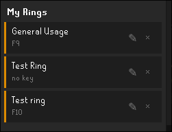
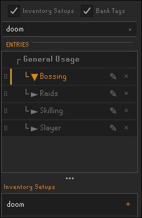
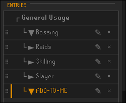
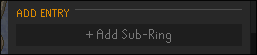
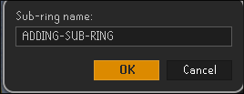
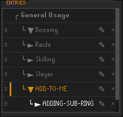
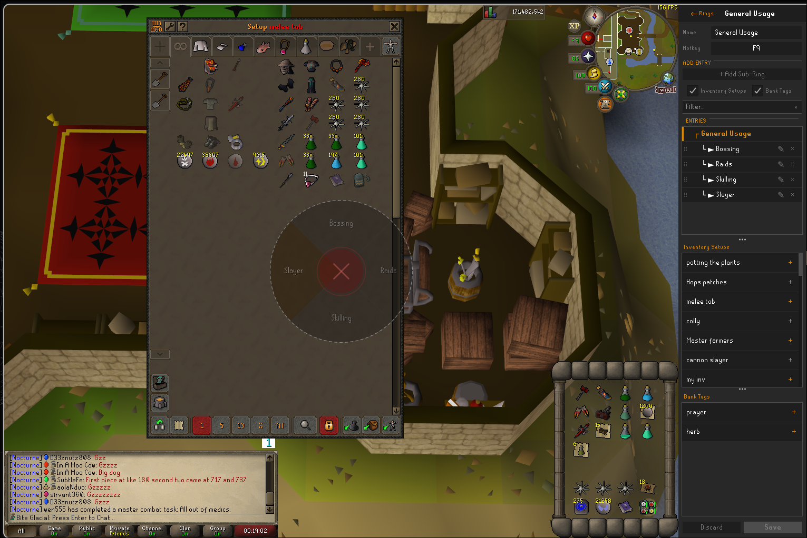

# Ring Menu

A radial hotkey menu for Old School RuneScape that lets you open any bank tag or inventory setup with a single keypress.

---

## Overview

Ring Menu lets you bind any number of radial menus to hotkeys. Each ring holds entries — bank tags, inventory setups, or sub-rings that lead to another ring. Press the hotkey, hover the slice you want, and click. The bank opens with your layout applied instantly.

**Requires:** [Bank Tags](https://github.com/runelite/runelite/wiki/Bank-Tags) · [Inventory Setups](https://runelite.net/plugin-hub/show/inventory-setups) v1.25.0+

---

## Features

- Bind multiple rings to different hotkeys
- Mix bank tags and inventory setups in the same ring
- Nest rings inside rings with sub-rings
- Toggle entries on and off without deleting them
- Horizontal or radial label text, chosen per ring and per sub-ring
- Labels shrink to fit their slice, and hovering shows the full name of a shortened label
- Adjustable ring size
- Search and filter your setups directly in the panel
- Drag and drop to reorder entries
- Rename rings and sub-rings in place
- Edits show up in an open ring immediately, and new setups and tags appear in the picker as you make them
- Entries pointing at a deleted inventory setup are shown in red

---

## Setup

### Creating a ring

Open the Ring Menu panel from the sidebar and click **+ New Ring**.

Give the ring a name, assign a hotkey, then open it to start adding entries.

### Adding entries

Inside a ring's detail view, use the provider picker at the bottom to browse your bank tags and inventory setups. Type in the filter box to narrow results, then click **+** to add an entry to the ring.

Click **Save** when you're done.

### Sub-rings

Sub-rings are rings nested inside another ring. When selected in the overlay they open their own ring, and the center button becomes a back arrow to return to the parent.

To add a sub-ring, open the ring you want to add it to and select the entry it should live under.

Click **+ Add Sub-Ring** in the ADD ENTRY section.

Enter a name for the sub-ring.

The sub-ring appears nested under the selected entry, ready to have its own entries added.

### The overlay

Press your hotkey anywhere in-game. The ring appears centered on screen — hover a slice to highlight it, click to activate. Right-click or click outside the ring to dismiss without selecting anything.

---

## Usage tips

- **Dismiss without acting** — right-click or click anywhere outside the ring
- **Navigate back** — click the center button (shows ‹) when inside a sub-ring
- **Reorder entries** — drag the grip handle on the left of any entry in the detail view
- **Rename** — click the ✎ button on any ring row or sub-ring entry
- **Hide an entry** — untick its checkbox in the detail view; it stays in the list but leaves the ring
- **Radial text** — click the H/R button on the ring's root row or a sub-ring row. Radial keeps long names readable on crowded rings
- **Red entry** — its inventory setup no longer exists, so delete it or recreate the setup under its original name. A sub-ring turns red when something inside it is broken, so you can spot it while collapsed

---

## Requirements

Ring Menu depends on the **Bank Tags** and **Inventory Setups** plugins. Both must be installed and enabled. Bank Tags ships with the default RuneLite client; Inventory Setups is available on the Plugin Hub.

Inventory Setups must be **v1.25.0 or newer**. Ring Menu talks to it over its plugin message API, which landed in that release. On an older version the Inventory Setups section of the entry picker stays empty.

---

## Update log

### 1.2.0

- Entries can be toggled on and off with a checkbox, without deleting them
- Label text orientation is chosen per ring, horizontal or radial (along the slice), on the root ring and on each sub-ring
- Long labels shrink to fit their slice before being truncated, and hovering a slice shows the full name when its label is shortened
- New ring size setting
- Changes made in the editor appear immediately in an open ring, keeping your place in sub-rings
- The entry picker and the red missing-entry highlights update live when inventory setups or bank tags change

### 1.1.0

- Inventory Setups entries now go through that plugin's message API instead of reading its config. Opening and clearing a setup is handled by Inventory Setups itself, so Ring Menu no longer depends on its storage format or its bank tag naming. This is what raises the requirement to Inventory Setups v1.25.0.
- Saved rings carry a schema version. Rings saved by earlier releases are migrated automatically the first time this version loads them, with no action needed. A saved value that cannot be read is left alone rather than overwritten.
- Entries whose inventory setup has been deleted are drawn in red, in both the editor panel and the ring itself.

### 1.0.3

- The ring no longer opens while you are typing in chat or in a search box
- Configurable overlay font and font size
- Fixed the label position on a ring holding a single entry

### 1.0.2

- Rings can be enabled and disabled individually
- Hotkeys accept modifier combinations
- Long labels are truncated to fit their slice
- Fixed the cancel action firing when it should not

### 1.0.1

- The entries list is constrained to the panel width, so its buttons are always reachable
- Filtering is instant, with no typing delay

### 1.0.0

Initial release: rings and sub-rings, the editor panel, and entries backed by bank tags and inventory setups.

---

## Future

Currently Ring Menu supports bank tags and inventory setups. Other integrations could be added if they make sense — open an issue if you have an idea.
